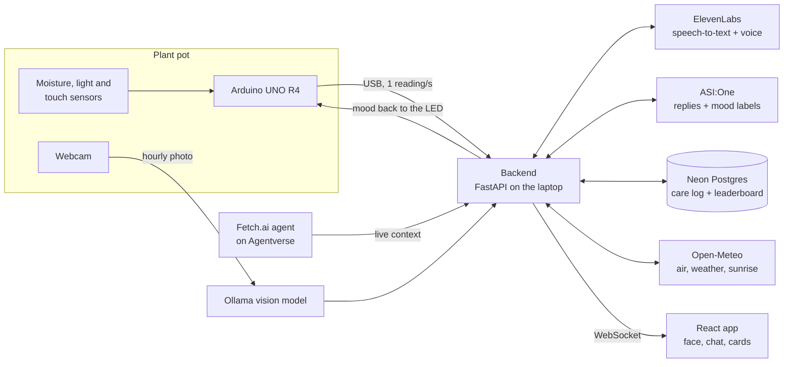

# Talking Plant

Talking Plant gives a real potted plant a voice so children can learn to care for it.
Sensors in the soil tell the plant when it is thirsty, too wet or in the dark; a cartoon
face on screen shows how it feels; and a child can pat its leaf and ask it questions out
loud. The plant answers in a friendly voice, using its real readings, and thanks the
child when it gets watered. Each child names their own plant (for example "Captain Leafy").

Built at MHacks 2026 for the Sustainability track.

## How it works



The plant works in two layers:

- **Live, every second (rules, no AI):** moisture and light decide the mood: happy,
  thirsty, soggy (too much water), too dark, sleepy (dark at night), unwell, or grateful
  right after a watering. The face, gauges and voice react instantly, even offline.
- **Checkup, every hour (AI):** the webcam photo is described by a local vision model,
  outdoor air and weather are fetched for the plant's ZIP code, and ASI:One labels the
  hour's mood. Rows are kept for 30 days in Neon. Each night ASI labels the whole day,
  and happy days count toward a global weekly leaderboard.

## Features

- **Talk to the plant:** pat the touch sensor or tap the big **Tap to talk** button.
  The plant greets the child, listens, and stops recording a second after they stop
  talking. Quick-question buttons work without a microphone.
- **Grounded, kid-safe replies:** answers quote real readings ("my soil is 18% wet"),
  remember the last few exchanges, know the time and weather, and include short plant
  facts. A safety filter rejects anything off-topic, too long or invented, and scripted
  lines take over when the internet or a key is missing.
- **Knows its plant:** at sign-up the webcam identifies the plant (for example "Aloe
  vera") and its type: succulent, houseplant or tree. The type sets when it is dry or
  too wet. The child can change both.
- **Real day and night:** sunrise and sunset at the child's ZIP code decide whether
  darkness means "sleepy" or "too dark"; the on-screen sky follows real weather.
- **Cards:** Water, Sunshine, Outside (temperature, conditions and air quality) and
  How I look (the leaves, as seen by the camera).
- **Leaderboard tab:** happy days in the last 7, for every registered plant.
- **Chat from anywhere:** a Fetch.ai agent on Agentverse lets you chat with the plant
  from ASI:One, using the same live context as the screen.

## Tech stack

| Part | Technology | Role |
|---|---|---|
| Hardware | Arduino UNO R4 WiFi, Grove moisture v1.4, light v1.2, touch v1.1, LED, USB webcam | Sensing; the LED lights for unhappy moods |
| Backend | Python 3.13, FastAPI, SQLAlchemy | Sensor ingestion, mood rules, care log, WebSocket to the UI |
| Frontend | React 18, TypeScript, Vite | Animated character, chat, cards, sign-up, leaderboard |
| Voice | ElevenLabs (Scribe speech-to-text, text-to-speech) | Hears the child, speaks as the plant; fixed lines cached for offline use |
| Language | ASI:One (`asi1-mini`) | Replies, hourly and daily mood labels |
| Vision | Ollama (`llama3.2-vision`, or `moondream` on small laptops) | Describes the leaves and identifies the plant; photos are never stored |
| Agent | Fetch.ai uAgents on Agentverse | Chat with the plant from ASI:One |
| Database | Neon serverless Postgres (SQLite locally) | Plants, 30-day care log, events, leaderboard |
| Location data | Open-Meteo, zippopotam.us, OpenStreetMap | Air quality, weather, sunrise/sunset, ZIP from "Use my location" |

## Quick start (no hardware)

Commands use `python`; inside the virtual environment that is `.venv/Scripts/python` on
Windows and `.venv/bin/python` on macOS/Linux. `make` targets do the same where available.

```sh
cp .env.example .env                       # add keys; blank keys switch to offline fallbacks
python -m venv .venv
python -m pip install --require-hashes -r requirements-dev.txt
python -m pip install -r requirements-vision.txt   # webcam features
npm --prefix frontend install

python -m backend.server                   # 1: backend on :8000          (make native)
npm --prefix frontend run dev              # 2: open http://localhost:5173 (make frontend)
python -m backend.sensors.bridge --mode arduino-mock --count 24   # 3: simulated Arduino
```

The first launch asks for the child's name, the plant's name and type (or a photo
check), and a ZIP code (typed, or **Use my location**). The simulated Arduino runs a
24-second story: dry soil, a pat on the touch sensor, then a watering.

Browsers keep sound and the microphone off until the page is tapped once;
`python -m scripts.kiosk` opens the app full screen with that turned off.

## Real hardware

See **[Arduino setup](docs/arduino-setup.md)** for wiring, calibration and the webcam.

```sh
python -m pip install -r requirements-arduino.txt
python -m backend.sensors.arduino             # list USB ports
# Upload hardware/talking_plant_hub/talking_plant_hub.ino with the Arduino IDE first.
python -m scripts.watch_sensors               # live raw readings while you calibrate
python -m backend.sensors.calibration --dry <raw> --wet <raw> --sensor-model "Grove moisture v1.4" --device-id arduino-plant-1
python -m backend.sensors.bridge --mode arduino --port COM3     # (make arduino)
```

Run only one backend per plant: two laptops on the same Neon database would both log it.

## Plant Care Agent (Agentverse and ASI:One)

```sh
python -m pip install --require-hashes -r requirements-fetch.txt
python -m backend.agent.chat_agent           # with the backend running (make agent)
```

The first time, open the "Agent inspector" link it prints, choose **Connect → Mailbox**
and sign in to Agentverse. Then **Chat with Agent** on Agentverse opens it in ASI:One.
The agent's address comes from `AGENT_SEED` in `.env`.

## Configuration

All settings live in `.env` (see [.env.example](.env.example)); the main ones:

| Setting | What it does |
|---|---|
| `DATABASE_URL` | Neon connection string; `sqlite:///./plant.db` locally; blank keeps memory only |
| `ELEVENLABS_API_KEY`, `ELEVENLABS_VOICE_ID` | Voice and speech-to-text (free plans need a default voice) |
| `ASI_API_KEY`, `ASI_MODEL` | Replies and mood labels |
| `OLLAMA_MODEL`, `CAMERA_INDEX`, `CAMERA_IMAGE` | Vision model, webcam, or an image file instead of the webcam |
| `ARDUINO_PORT`, `CALIBRATION_PATH` | The board's USB port and the saved moisture calibration |
| `LOG_INTERVAL_MINUTES`, `DAY_LABEL_TIME` | Checkup interval (60, or 1 for demos) and the nightly label time |
| `DEMO_MODE` | Enables the hidden demo controls |
| `AGENT_SEED` | Identity of the Agentverse agent |

## Demo tips

- `make native-fast` runs a checkup every minute without editing `.env`.
- **Shift+D** opens hidden demo controls: dry then watered, dry, healthy, dark, log a
  checkup now, or label today (needs `DEMO_MODE=true`).
- `python -m backend.speech.pregenerate` records every fixed line so they play offline.
- `python -m scripts.check_services` checks Neon, ElevenLabs, ASI:One, the agent,
  Ollama and the air APIs live before you go on stage.

## Project layout

| Path | Contents |
|---|---|
| `hardware/talking_plant_hub/` | Arduino sketch: one JSON line per second, mood LED |
| `backend/sensors/` | USB bridge, simulated and replay modes, calibration |
| `backend/agent/` | Mood rules (`mood.py`), touch gating, the ASI:One chat agent |
| `backend/care_log.py` | Hourly checkup and nightly day label |
| `backend/conversation/` | Replies, safety filter, scripted lines, mood labels, plant facts |
| `backend/speech/` | ElevenLabs speech-to-text and voice with an offline cache |
| `backend/vision/` | Webcam capture, leaf description, plant identification |
| `backend/air.py` | Air quality, weather, sunrise/sunset and ZIP lookups |
| `backend/database/` | Tables, migrations and queries (Neon/PostgreSQL or SQLite) |
| `backend/api.py`, `backend/ui.py` | HTTP and WebSocket routes ([docs/api.md](docs/api.md)) |
| `backend/service.py`, `backend/config.py` | The running service and every setting |
| `frontend/` | React app |
| `shared/` | Message contracts, generated schemas and samples, default plant profile |
| `scripts/` | Kiosk launcher, service check, database viewer, sensor watcher, benchmarks |
| `docs/` | [API](docs/api.md), [mood rules](docs/mood-engine.md), [Arduino setup](docs/arduino-setup.md), [deployment](docs/deployment.md), [remaining work](docs/remaining-work.md) |

## Checks

```sh
python -m pytest -q                                # make test
python -m ruff check backend shared scripts tests  # make lint
python -m scripts.export_contracts                 # make schemas, after changing contracts
python -m scripts.show_db                          # print the database (read-only)
python -m scripts.asi_latency                      # ASI:One speed with 24 hourly rows
npm --prefix frontend run build
```

`make lock` regenerates the hashed requirement files for every platform (needs `uv`).
